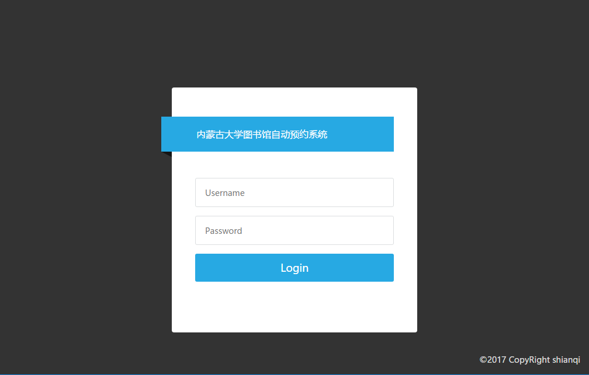
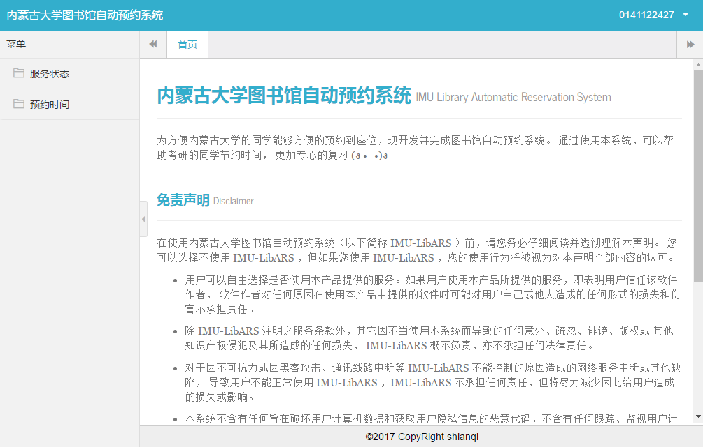
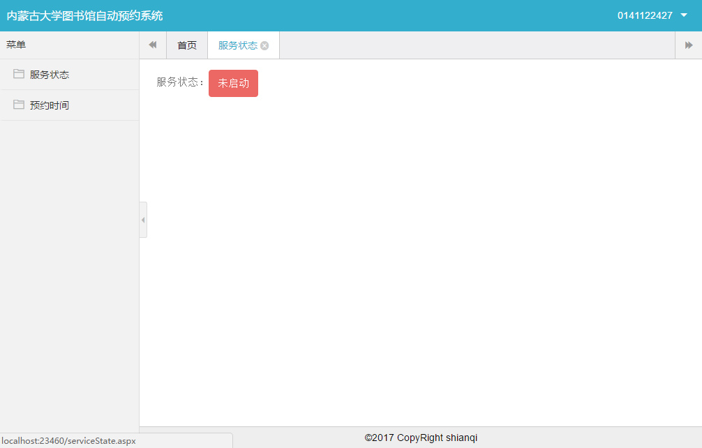

# 内蒙古大学图书馆自动预约系统

为方便内蒙古大学的同学能够方便的预约到座位，现开发并完成图书馆自动预约系统。 通过使用本系统，可以帮助考研的同学节约时间， 更加专心的复习 (ง •_•)ง。

## 软件目录

## 安装须知

## 所用技术

## 系统登陆界面

## 系统首页

## 用户服务开关

## 预约规则设置

## 免责声明
在使用内蒙古大学图书馆自动预约系统（以下简称 IMU-LibARS ）前，请您务必仔细阅读并透彻理解本声明。 您可以选择不使用 IMU-LibARS ，但如果您使用 IMU-LibARS ，您的使用行为将被视为对本声明全部内容的认可。

* 用户可以自由选择是否使用本产品提供的服务。如果用户使用本产品所提供的服务，即表明用户信任该软件作者， 软件作者对任何原因在使用本产品中提供的软件时可能对用户自己或他人造成的任何形式的损失和伤害不承担责任。
* 除 IMU-LibARS 注明之服务条款外，其它因不当使用本系统而导致的任何意外、疏忽、诽谤、版权或 其他知识产权侵犯及其所造成的任何损失， IMU-LibARS 概不负责，亦不承担任何法律责任。
* 对于因不可抗力或因黑客攻击、通讯线路中断等 IMU-LibARS 不能控制的原因造成的网络服务中断或其他缺陷， 导致用户不能正常使用 IMU-LibARS ，IMU-LibARS 不承担任何责任，但将尽力减少因此给用户造成的损失或影响。
* 本系统不含有任何旨在破坏用户计算机数据和获取用户隐私信息的恶意代码，不含有任何跟踪、监视用户计算机的功能代码， 不会监控用户网上、网下的行为，不会收集用户使用其它软件、文档等个人信息，不会泄漏用户隐私。
* 本系统免费为内蒙古大学同学提供服务，任何单位或个人不得将本系统用于商业用途。
* 本网站相关声明版权及其修改权、更新权和最终解释权均属 IMU-LibARS 所有。